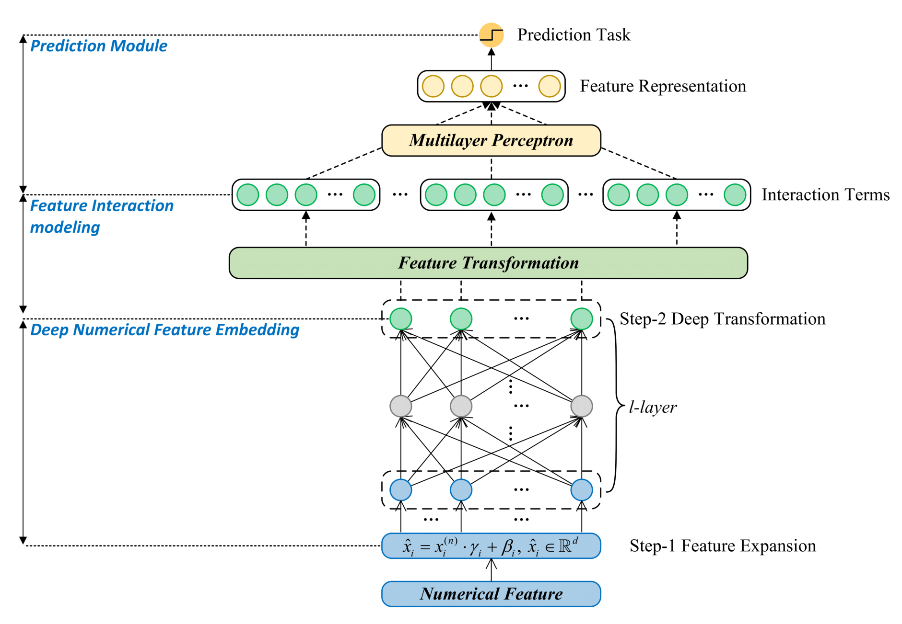
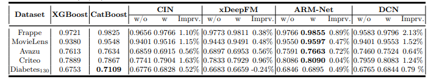
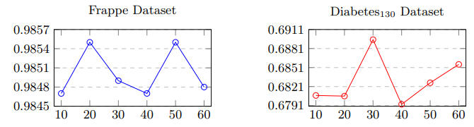
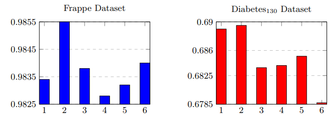

# Deep Feature Embedding for Tabular Data


## Abstract
This project addresses the limitations of existing embedding techniques for tabular data, particularly in handling numerical and categorical features. We propose a novel deep embedding framework utilizing lightweight deep neural networks to generate effective feature embeddings. Our approach includes two main methods: numerical feature embedding and categorical feature embedding, both designed to capture complex relationships and enhance the performance of models in real-world applications.

## Numerical Feature Embedding

1. **Feature Expansion:** Numerical features are expanded into higher-dimensional vectors to enhance the sensitivity and capture more detailed information.
2. **Deep Transformation:** These expanded vectors are then processed through a Deep Neural Network (DNN) to learn complex non-linear interactions, significantly improving embedding effectiveness.

## Categorical Feature Embedding

1. **Entity Identification:** Each categorical feature is assigned a unique identification vector using a compact lookup table, ensuring efficient and effective representation.
2. **Deep Transformation:** Similar to numerical features, these identification vectors are then transformed using a DNN, restoring them to a uniform embedding size and leveraging the modeling capacity of deep networks.

## Datasets
The proposed methods were evaluated on various real-world datasets, each representing different task types. The datasets used in our experiments are as follows:

| **Name**      | **Tuples** | **Fields** | **Features** | **Task Type**                     |
|---------------|------------|------------|--------------|-----------------------------------|
| Frappe        | 288,609    | 10         | 5,382        | Recommendation Systems            |
| MovieLens     | 2,006,859  | 3          | 90,445       | Recommendation Systems            |
| Avazu         | 40,428,967 | 22         | 1,544,250    | Click-Through Rate Prediction     |
| Criteo        | 45,302,405 | 39         | 2,086,936    | Click-Through Rate Prediction     |
| Diabetes\_130 | 101,766    | 43         | 369          | Healthcare                        |

## Experimental Results
The effectiveness of our deep embedding methods was tested against several traditional and state-of-the-art embedding techniques. The table below summarizes the overall prediction performance across different datasets:

| **Embedding Method**         | **Frappe** | **MovieLens** | **Avazu** | **Criteo** | **Diabetes\_130** |
|------------------------------|------------|---------------|-----------|------------|-------------------|
| Original Model Embedding     | 0.9766     | 0.9548        | 0.7591    | 0.8086     | 0.6846            |
| Handcrafted Embedding        | 0.9782     | 0.9481        | 0.7513    | 0.7857     | 0.6829            |
| Linearly-Scaled Emb          | 0.9789     | 0.9572        | 0.7651    | 0.8092     | 0.6853            |
| Discretization & Emb         | 0.9763     | 0.9504        | 0.7524    | 0.7984     | 0.6765            |
| Embedding Lookup             | 0.9792     | 0.9513        | 0.7606    | 0.8074     | 0.6846            |
| Hashing & Lookup             | 0.9749     | 0.9547        | 0.7487    | 0.7888     | 0.6871            |
| Deep Ensemble w/o GBDT       | 0.9808     | 0.9487        | 0.7393    | 0.7782     | 0.6764            |
| Deep Ensemble w/ GBDT        | 0.9808     | 0.9567        | 0.7441    | 0.7992     | 0.6851            |
| TabZilla Framework           | 0.9760     | 0.9560        | 0.7411    | 0.7832     | 0.6783            |
| **Deep Embedding (Ours)**    | **0.9855** | **0.9597**    | **0.7663**| **0.8090** | **0.6895**        |

## Ablation Study
The ablation study was conducted to evaluate the performance of the proposed framework compared to baseline models without the embedding framework. The results indicate significant improvements in AUC when using our deep embedding approach, particularly on datasets like Frappe and Diabetes\_130.

## Hyperparameter Analysis
The impact of varying the number of deep transformation layers on model performance was investigated. It was found that the optimal number of layers varies by dataset, with Frappe showing best results with two layers, while the Diabetes\_130 dataset benefited from more layers to capture its complexity.



*Figure 3: Impact of Embedding Size on AUC Improvement for ARM-Net with Our Deep Embedding Framework on Frappe and Diabetes_130 datasets*



*Figure 4: Impact of Deep Transformation Layer size on ARM-Net Performance: AUC Evaluation on Frappe and Diabetes_130.*

## Citation

If you use this code or reference this work in your research, please cite the following paper:

```bibtex
@article{Wu2024DeepFeatureEmbedding,
  title={Deep Feature Embedding for Tabular Data},
  author={Yuqian Wu, Hengyi Luo, Raymond S. T. Lee},
  journal={Journal of Data Science},
  year={2024},
  url={https://github.com/yourusername/DeepFeatureEmbedding}
}

## Acknowledgments:
This research was supported by *Beijing Normal University-Hong Kong Baptist University United International College (UIC)* and the *IRADs lab*. 
The authors express their gratitude for providing the necessary computational facilities.

